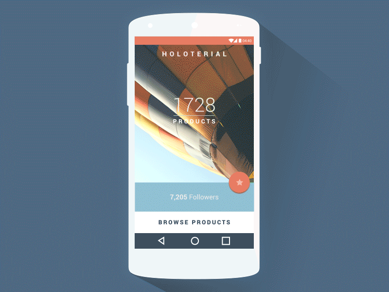
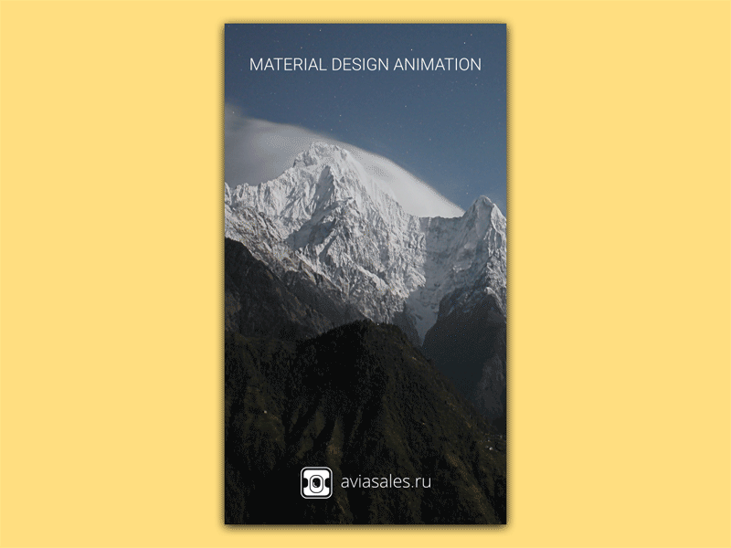
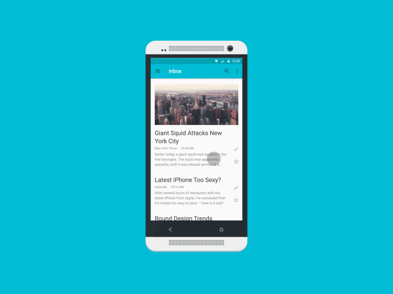
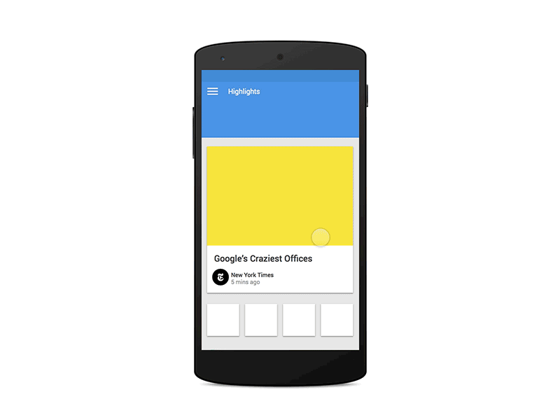
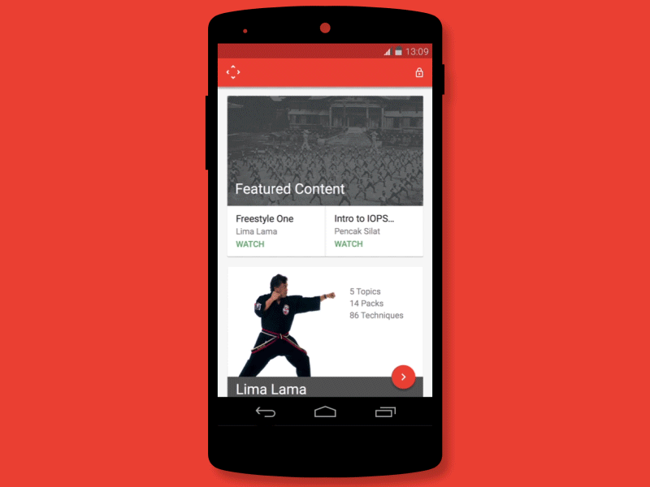
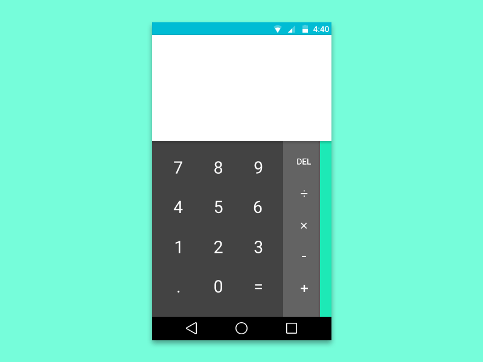
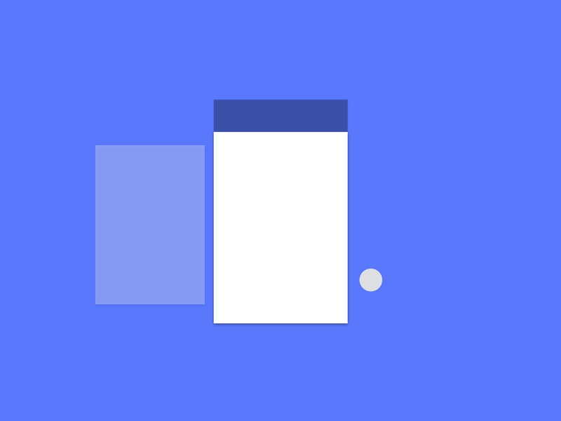

# android L 技术调研解读

> 原创：余俊卿 转载请:<yujunqing@meizu.com>

----

> 仅仅站在系统应用的角度作的解读，基于sdk组的调研结果和个人补充


## 一、SDK组调研目录：

````
1. Material Design介绍：
Material Design中文版

向下兼容实现Material Design风格的控件以及酷炫的动画效果（一）

向下兼容实现Material Design风格的控件以及酷炫的动画效果（二）

2. 控件、交互：
Android5.0 RecyclerView特点、用法、及自定义动画

Android5.0 RecyclerView和CardView用法

Android5.0 Notifications新特性

Android 5.0 Shadow、Outline和Clip用法

Morning routine alarm clock中MenuAndBackButton的实现

ActionBar上滑消失、下滑增大的实现

Android LayoutRtl ——从右到左布局

3. 动画、视觉、触摸反馈：
Android5.0 Activity过渡动画

Android5.0 新动画

Morning Routine炫酷动画分析

Android5.0 触摸反馈

Android5.0 Circular Reveal

Android5.0 RippleDrawable、Circular Reveal、Touch feedback

Android RenderScript简介

4. 主题、样式、颜色、资源：
Android5.0 主题色、状态栏及导航栏背景色

Android5.0 新主题样式：Material Theme

Android5.0 Palette调色板 简介

Flyme 4资源放置规则

5. 性能、功耗、内存：
Android5.0 之JobScheduler（减少系统和程序的电量消耗）

静态成员和内部类的错误使用导致的内存泄漏问题分析

6. 开源库、App剖析：
Android-Universal-Image-Loader使用教程（图文）

Android依赖注入常用库对比简析

统一使用最好的图片加载和Http请求库（一）

”豆瓣东西“应用架构和开源库分析
````


## 二、并不新的技术

````
6. 开源库、App剖析：
Android-Universal-Image-Loader使用教程（图文）

Android依赖注入常用库对比简析

统一使用最好的图片加载和Http请求库（一）

”豆瓣东西“应用架构和开源库分析
````

这里面介绍的东西最有营养的就是ImageLoader的推荐使用，常用于在线图片的异步加载。

依赖注入的几个库都不是很适合系统应用使用，因为依赖注入基本是基于java反射的原理，效率不是很好（有一个很特别的库是在编译时生效，我之前用过，但他有一个很蛋疼的规则就是activity名后面都需要加一个_），并且最关键的一点是一般它要求在应用生命周期很早的阶段使用，才能保证它不出错，会难以优化应用启动速度、切换速度，并且会拿住所有的引用不方便内存回收（特别是我们的系统应用本来就难回收）。

## 三、可能有用的新技术

> 这一块的新技术大部分取决于UI，如果UI不学习这方面的东西，会导致我们不能使用这方面的新技术。

##### 1、Android5.0 Palette调色板

这个已经被google继承到support-v4里去了（21.0.0之后版本）。

一句话来形容就是效率高、功能强、使用简单，并且和android5.0的新主题有着相当好的呼应。

**PS：可以考虑利用这个对通知栏下面的颜色取值然后动态改变通知栏颜色。（当然实际上肯定需要结合C层用：C层获取到状态栏底下的颜色均值然后交给调色板计算出通知栏应当显示的颜色）**

**调色板在之后的应用层应该需要得到大量的推广，甚至个人觉得应该让UI方面的负责人更清楚了解这个功能，减少他们在配色上的工作，也能更好得规范flyme5的颜色搭配。**

##### 2、Android5.0 新主题样式：Material Theme

首先很多控件效果是必须基于这个主题的，然后这个主题是我们现有的颜色主题完全的强化升级版。

这一部分主要还是sdk和UI那边的事情。

## 四、必须掌握的新技术

> 这个建议每个人都仔细看一遍，最好能够再上网搜一搜相关的内容。

##### *. Material Design 中文翻译

[http://design.1sters.com/](http://design.1sters.com/)

居家必备启蒙教材

##### 1. 功耗 -- JobScheduler

[http://redmine.meizu.com/documents/234](http://redmine.meizu.com/documents/234)

简单来说就是alarmclock的进化版，考虑到了省电和功耗，使用上也不再依赖Intent，方便很多。

##### 2. 控件 -- RecyclerView

[http://redmine.meizu.com/documents/222](http://redmine.meizu.com/documents/222)

结构更优化，更方便实现复杂的列表，更方便定义动画，listview的完美升级

##### 3. 属性 -- shadow、Outline和Clip

[http://redmine.meizu.com/documents/238](http://redmine.meizu.com/documents/238)

android自带的阴影、边框、形状裁剪

##### 4. 其它

* 不再支持splitActionBarWhenNarrow

* View支持theme属性（主要可以用于toolbar）


## 五、可以应用的新技术

#### 1. [关于notification](http://redmine.meizu.com/documents/217)


* 可扩展的布局

  你可以选择在应用程序通知上提供更多的细节。他们能显示前几行信息或显示出更大的图像预览。用户只需通过执行一个手指滑动在伸缩和扩展的布局之间切换。Android提供了三个可扩展的布局模板（Text，Inbox，和Picture）

* 浮动通知

  这个iphone上有得


* 优先排序
  
  Priority(优先级) 和 新增 Catergor属性

* 敏感等级
  VISIBILITY_PUBLIC.可以显示notification的全部内容。如果没有设置Visibility属性，这是系统默认的值。
  
  VISIBILITY_PRIVATE. 在锁屏情况下，会提示notification存在的信息，只包括notification的图标和app名字。其他的内容不会显示。有几个要点是需要记住的是：
  
  * 1.如果你想在安全锁屏时提供一个不同的public版本通知，只需要更换notification.publicversion就行。

  * 2.这种方式很有用，即能给你提示又不透露个人信息的内容。比如说一个短信的通知，包括的短信，发信人的姓名和联系图标。该通知应设为VISIBILITY_PRIVATE，但publicversion仍然可以包含像“3条新消息“，这样就没透露出其他细节信息。
Notification.VISIBILITY_SECRET.不会在锁屏情况下，显示任何信息，连图标都不会。

* 用户可选通知优先级

#### 2. 关于动画



1. [个人觉得sdk文档里最有价值的一篇 -- Morning Routine炫酷动画分析](http://redmine.meizu.com/documents/231)

2. android5.0新动画：
  
   * 触摸反馈动画
   
   * 揭露动画
   
   * 曲线运动 新的插值器 PathInterpolator
   
     在android5.0(api21)及以上，可以自定义动画时间曲线和曲线运动模式。
   
   * View状态切换动画
   
   * 可动画的矢量图 VectorDrawable
   
     1、VectorDrawable是Android L中新增的一个API，让你可以创建基于XML的矢量图，并结合AnimatedVectorDrawable来实现动画效果。
     
     2、Android L新增支持Vector标签，可以使用Path创建动画，同时支持SVG格式。

3. [非常有用但我们小组用不上的Android5.0 Activity过渡动画 ---- 有可能应用到锁屏和桌面的过渡上？](http://redmine.meizu.com/documents/211)

据崔英云说5.0里地动画实现方式几乎完全改变了，以前的动画接口虽然接口没变，但是实现上基本都不一样了。整个动画给人的感觉就是：流畅、自由，举一个很简单地例子是，现在view的动画可以很方便的做到view绘制区域的外面去了。


这一块的分析sdk组做的还远远不够，各种细节需要大家一起研究，当然不到真正用的时候确实也没法做到研究透彻。以下放出一些例子：


















## 六、画外音

> 个人7月份入职以来收获的部分知识（适用于系统应用这一块的）简单分享给大家

* 强力推荐

  *  [一个	有名的公司总结的Android development手册](https://github.com/futurice/android-best-practices)

  * [好的不能再好的开源库推荐索引（因为是中文的）](https://github.com/Trinea/android-open-project)

  * [oh-my-zsh 如果不知道这个，简直白瞎了命令行](https://github.com/robbyrussell/oh-my-zsh)

* 动画

  * [在低版本的android里实现点击后的波纹效果 ---- 可以在通知栏实现](https://github.com/traex/RippleEffect)

  * [在悬浮球里使用的回弹动画框架 -- 来自facebook](https://github.com/facebook/rebound)

  * [值得看一看的简单动画实现1 -- 创建自己动画的时候可以借鉴](https://github.com/2359media/EasyAndroidAnimations)

  * [值得看一看的简单动画实现2 -- 创建自己动画的时候可以借鉴](https://github.com/daimajia/AndroidViewAnimations)
  
  * [对于java来说 可能是最简单的复杂动画实现框架 -- 缺点在于性能和耗电](https://github.com/libgdx/libgdx)

* 代码优化

  * [真心推荐给大家使用的开源库 效果类似于广播（局限在于无法跨进程）](https://github.com/greenrobot/EventBus)

* 其它推荐
  
  * [偷懒专用 -- layout.xml中view绑定的代码生成](http://android.lineten.net/layout.php)

  * [是时候 提升一下对用户体验的感觉了！](http://uec.nq.com/)
  
  * [是时候 提升一下对设计的感觉了！](http://www.sketchappsources.com/)
  
  * [非常好的开源库索引1 -- 有一点不好的就是推荐的太多了](https://android-arsenal.com/free)

  * [非常好的开源库索引2 -- 有一点不好的就是推荐的太多了](http://alamkanak.github.io/android-libraries-and-resources/)


### 附件：

* [What's New in Android 5.0 Lollipop](http://android-developers.blogspot.com/2014/10/whats-new-in-android-50-lollipop.html?utm_source=feedburner&utm_medium=feed&utm_campaign=Feed%3A+blogspot%2FhsDu+%28Android+Developers+Blog%29)

* [goole I/O 2014 Android App](https://www.youtube.com/watch?v=mCgteBXYxQc)

### APK:

* [notification.apk](res/notification.apk)

* [Google IO 2014_com.example.android.io2014_1.apk](res/Google IO 2014_com.example.android.io2014_1.apk)

* [Morning Routine_net.havchr.mr2_27.apk](res/Morning Routine_net.havchr.mr2_27.apk)

* [VectorDrawable.apk](res/VectorDrawable.apk)


* [Lollipop Showcase_com.mikepenz.lollipopshowcase.sample_221.apk](res/Lollipop Showcase_com.mikepenz.lollipopshowcase.sample_221.apk)

* [Material Manager_com.inspire.materialmanager.inspirefm_730.apk](res/Material Manager_com.inspire.materialmanager.inspirefm_730.apk)

* [AndroidLAnimation_com.example.androidlanimation_1.apk](res/AndroidLAnimation_com.example.androidlanimation_1.apk)


