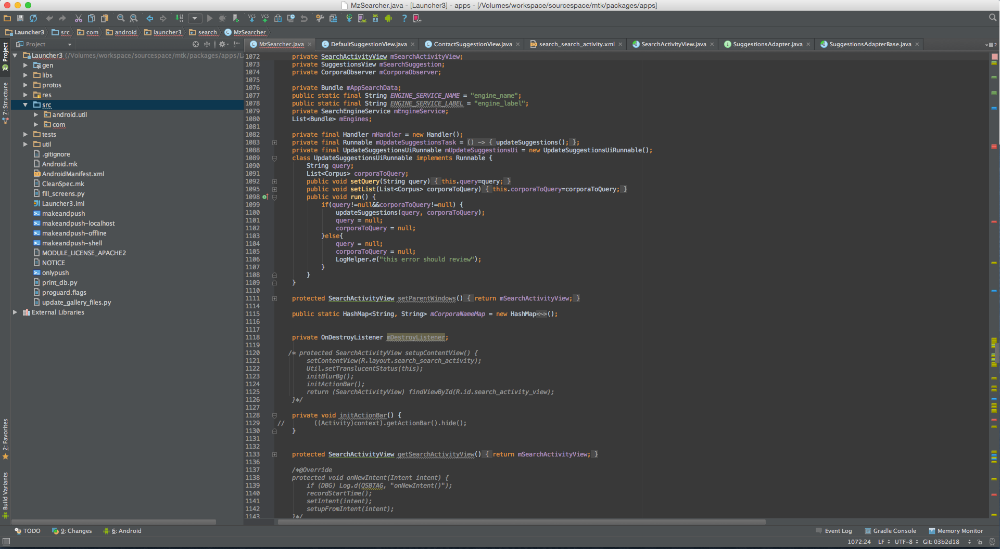
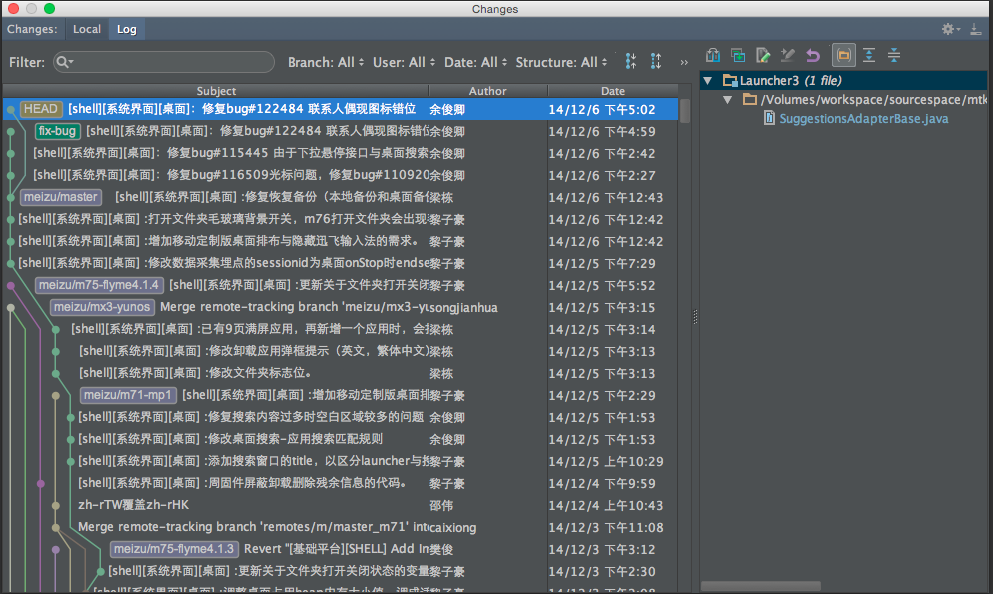
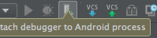
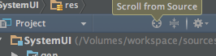

# android-studio使用推广

> 原创：余俊卿 转载请:<yujunqing@meizu.com>

----

> 下载地址： smb://172.16.1.95/研发中心/FlymeOS/软件开发/shell组/Temp/Jianwu_Gao

# android studo 简介
<br>
## 首先上一张使用android studio开发桌面的截图
<br>

<br>
## 然后上一张android studio自带实用插件的截图  git插件
<br>

<br>

### 很显然的是android studio自带了很强的代码功能，以及插件功能功能，它的前身**IntelliJ IDEA**被称为“The Best Java and Polyglot IDE”

### 丰富的插件，比如自带git，自带终端，自带等等

### 几乎eclipse有的功能，androidstudio都有，并且更强。

### 并且androidstudio可以调成eclipse快捷键

<br>
# 将源码导入android studio
## （整个源码导入的话相对更推荐使用 IntelliJ IDEA 可能更适合一些）
## 强烈建议此种方法只是用来看源码，大部分情况下我们直接工作的目录是单模块，没必要导入整个源码，模块之间的紧耦合的地方也可以用双工程的方式解决
**不同于eclipse，源码无法直接通过.classpath文件导入androidstudio，但是google在发布源码的时候专门给了一个工具用来生成适配androidstudio项目文件的工具。使用方法如下：**

````
sourcecode='你的源码目录'
cd $sourcecode
#ps:可能先需要跑一边launch，如果是mtk代码则把make替换成./makemtk
#总之就是我们平时编译单模块的命令
mmm development/tools/idegen
./development/tools/idegen/idegen.sh
````
这样就会在源码目录下生成android.ipr文件，这个就是androidstudio的.classpath

然后使用android-studio的open即可打开源码目录！

````
接着请设置java-sdk，或者android-sdk，建议设置后者，因为可以打开更多android相关的功能
Settings > Project Stucture  或者Default Structure 里面设置
之后就等吧，漫长的索引建立过程
完成索引之后可能需要重启一下android-studio，让其重新打开一些功能
````

**但仅仅到这一步，会非常非常慢，因为ide会生成大量索引文件，不仅耗时，而且降低了后面搜索的速度和准确率，因此需要手动去除一些不要的目录**

````
Settings > Project Stucture 打开项目管理
选中左侧Modules，然后再右侧Sources中将一些目录Excluded掉，比如out、xxx等等（会导致R文件报错，处女座慎重）
ps:一定不要吧 gen 目录exclu了，否则很多索引都没用了
当然也可以手动加入一些文件目录，相信大家都懂

````
### 进阶设置  此步骤为源码导入支持调试的必备步骤
到了现在android-studio的优势还体现得不多，这时候可以稍加设置，体现其与android紧耦合带来的优势

````
以SystemUi为例
Project Structure > Modules 
在右边的sources里面找到SystemUi根目录（可以输入flyme快速定位）
然后把res文件夹标记为Resources
接着在中间一栏新建一个Android module
选中后在右边填入路径：
flyme/frameworks/base/packages/SystemUI/AndroidManifest.xml
flyme/frameworks/base/packages/SystemUI/res
flyme/frameworks/base/packages/SystemUI/assets
flyme/frameworks/base/packages/SystemUI/libs
最后选择generated sources标签，里面填入
flyme/frameworks/base/packages/SystemUI/gen
flyme/frameworks/base/packages/SystemUI/gen
然后就可以OK了
重启后会发现所有这个工程下的R文件都可以直接链接到真实地文件了！更多细节请自行体会
进行了这个步骤之后就可以按照后面的调试教程进行调试了，比eclipse方便很多！
````

### 可能出现的问题

````
有些同学可能发现类跳转有问题，比如跳转Context，结果跳转到framework.jar里的Context去了
这个也是因为这个ide太强大导致的，直接可以读.jar
解决方法很简单，删掉这个jar就OK了
````


<br>

# 将单项目导入android studio
大部分情况下，单模块开发没必要导入整个android工程，单项目导入速度可以更快，匹配更准确
以keyguard为例


````
Import Project -- $sourcecode/flyme/frameworks/base/package
ps:此处选择的时keyguard的上级目录，之所以这样做是因为这样更方便处理git以及避免导入失败
然后在下一步中选择你需要的工程keyguard和其manifest.xml即可完成导入
之后设置一下android sdk 和java之类的即可
````

# 将android-studio的内存堆栈加大
当然还有一个终极加速方案：

在android的安装目录里有一个bin文件夹，里面放了一个studio64.vmoptions，前三个参数尽情调大吧，不要白瞎了我们16GB的内存！
我调的是1024 2048 700

<br>
# 界面设置
可能有人问，为什么我下载的androidstudio是白色的，截图的却是黑色的。很简单

````
Settings > Appearance > Theme
选择Darcula
````
还有很多人习惯显示的行号

````
Settings > Editor > Appearance > Show line number
ps:字体颜色什么的也在Editor
````

另外貌似比较早的android-studio版本对中文支持有问题，请百度解决

````
Settings > Appearance 里面换一下字体即可
````

<br>
# 使用android studio调试源码
由于我基本不使用整体导入源码的方式，所以只介绍一下单模块的调试方法：

<br>

<br>

````
断点还是一样的断点，调试入口变得如此傻瓜，在顶上的toolbar里就能找到
ps：当然也有较为类似eclipse的设置方式
````

<br>
# 常用快捷键&功能
**首先强调一点，android-studio是具备自动保存功能的！也就是极少数情况下才需要你手动去ALT+S，然后它是会自动补全代码的，还有一个Command + Enter 或者 ALT + Enter 按键会帮助你再提示的引导下完成一些代码优化或补全。并且不得不提的是，他有很强的local history功能，之前还没接触git的时候一直都是在用这个功能。**

<br>

````
另外在 Settings > Keymap里可以把默认键位调成eclipse系
````
<br>

先推荐两篇图文并茂的文章

http://greenrobot.me/android-dev-tool/android-studio-dev-tips-1/

http://greenrobot.me/android-dev-tool/android-studio-dev-tips-2/

常用快捷键索引：http://blog.sina.com.cn/s/blog_4e1e357d0101b4s2.html

<br>

使用android-studio不得不首推它的 find everywhere 功能，好用得痛哭流涕！

````
连按两下Shift即可呼出搜索框，随便键入你想要找得内容吧！
超级强大的搜索功能，能够找到文件，功能，书签等等东西，说白了就是一个合集，而且速度很快！
我之前一直都这么使用：
连按两下Shift > 输入find in path > 回车打开全文搜索功能
连按两下Shift > 输入bookmark > 书签

不喜欢急快捷键的懒人居家必备功能！
ps:当然android-studio是支持单独搜索文件、功能等等的
````
````
类文件结构弹窗

OS X: Command+F12
Windows Or Linux: Ctrl+F12

另外其实在默认界面左边竖着的一溜里面有一个Structure 也是可以看结构的！
````
````
在方法和内部类之间跳转
OS X: Ctrl + ↑ / ↓
Windows Or Linux: Alt+ ↑ / ↓

这个快捷键可以让你很方便的在当前文件的方法或者类上面跳转。
````
````
行复制
Mac OS: Command+D
Windows & Linux: Ctrl+D

这个快捷键的厉害之处在于它会复制当前行同时又不会影响系统的剪贴板。
````

````
包裹代码段
Mac OS : Command+Alt+t
Windows & Linux : Ctrl+Alt+t
此操作会选中一段代码段，然后使用if语句或者循环等结构包裹这段代码。当然，如果你什么都没选择，那么它会默认选择当前行代码。

移除包裹代码
Mac OS : Command+Shift+Delete
Windows & Linux : Ctrl+Shift+Delete

移除代码结构中的包裹代码，比如 if 语句,  while 循环, 或者 try/catch 语句
````

````
查询最近编辑文件
Mac OS : Command+e
Windows & Linux : Ctrl+e
````

````
进阶代码补全
Mac OS : Command+Shift+Enter
Windows & Linux : Ctrl+Shift+Enter

这个操作会将还未完成的代码结构补全。一般可以补全的情形如下：

在代码行后面添加分号；
为 if, while 或者 for 语句添加括号
为方法声明添加括号。
````

<br>
# 插件推荐

插件在Settings > Plugins 处安装和管理，Browse Repo 里面可以看到很多、相当多、非常多插件选择！

````
首先请在Settings > Plugins 里关掉一些没用的插件，比如google login ，Google Cloud ,CVS Integration ，Subversion Integration ,Copyright , TestNG-J ，Github 这个个没用或者不适用的。

Gradle 和Groovy 的话，如果只是调试系统和模块源码不参与单独应用或者看网上开源应用的话，也可以关掉

喜欢内置终端的同学可以保留Terminal，但请先给它设置一个快捷键

Git Intrgration建议保留，因为自带的git插件实在太牛逼了！
````

````
推荐一个插件AceJump ，非常方便的跳转，谁用谁知道！（在Ubuntu下有问题）

acejump用不了的情况下，推荐QuickJump，没有acejump好用，但是能凑合吧。

推荐一个插件IdeaVim ，看名字就知道是把编辑框里的快捷键变成vim快捷键，强烈推荐给Vim大神们！

推荐一个插件BashSupport , 方便写bash脚本的。
````


<br>

# eclipse项目转化为gradle项目
说道这个就不得不先说gradle，非常非常非常强大的构建工具。介绍这个都得很长一篇了。但对大多数人没用，此处就略过了。

由于eclipse里建的android默认新建的项目的目录结构和android-studio里不一样，所以得在android-studio里地build.gradle里稍加改变

````
android {
    compileSdkVersion 21
    buildToolsVersion 21
    defaultConfig {
        minSdkVersion 10
        targetSdkVersion 21
        versionCode 1
        versionName "1.0.0"
    }
    
    compileOptions {
        sourceCompatibility JavaVersion.VERSION_1_7
        targetCompatibility JavaVersion.VERSION_1_7
    }
    
    sourceSets {
        main {
            java.srcDirs = ['src']
            res.srcDirs = ['res','res2']
        }
    }
}

其实就是在android标签里加入一块sourceSets，来定义本项目的目录结构，我猜测大家能看懂吧应该。

````

再推荐一篇比较好的教程索引：

https://github.com/Damao/Intellij-IDEA-F2E

# 其它问题


**此处Project处（左上角）可以选择目录机构的展示方式，可能很多人不喜欢Android式，建议调成Project式**



**这个地方的按键很有用，可以快速定位到你在右边窗口里打开文件的位置**

<br>

未完待续·欢迎 git clone http://172.16.11.120/doc/androidstudio.git 并补充你的经验！