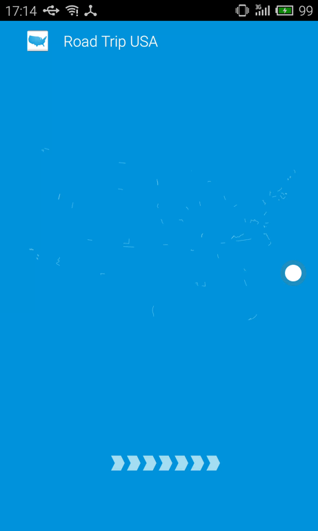
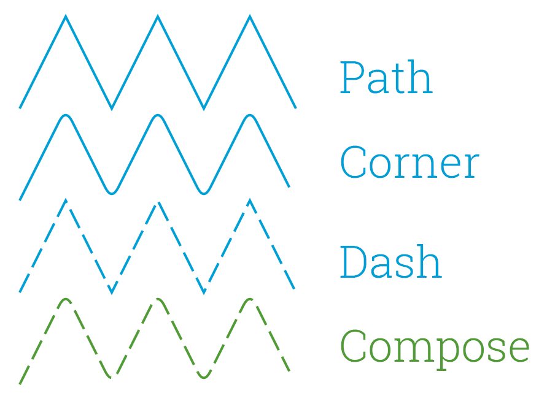

# android矢量动画

> 原创：余俊卿 转载请:<yujunqing@meizu.com>

----

看到这个动画是不是很炫酷，觉得在android L 之前难以实现？

近日才看到这篇文章<http://www.curious-creature.com/2013/12/21/android-recipe-4-path-tracing/>

这个demo和这篇文章都是弄android图形框架的人写的。。

捡重要的翻译一下：

路径效果可以基于一个鲜为人知的API实现--[PathEffect](http://developer.android.com/intl/zh-cn/reference/android/graphics/PathEffect.html),它可以设置在画笔（Paint）上，然后用于Canvas.drawPath()。现在已经实现四种类型的路径效果：

* CornerPathEffect
* DashPathEffect
* DiscretePathEffect
* PathDashPathEffect

这四种效果可以通过ComposePathEffect或者SumPathEffect来混合使用。

例子如下：

