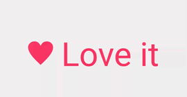

# 利用xml创建vectorAnimation（一）

> 原创：余俊卿 转载请:<yujunqing@meizu.com>

----


这个实现非常简单：

````
<CheckBox xmlns:android="http://schemas.android.com/apk/res/android"
    android:id="@+id/text"
    android:layout_width="wrap_content"
    android:layout_height="wrap_content"
    android:layout_gravity="center"
    android:background="@null"
    android:button="@drawable/fill_in_heart"
    android:gravity="center"
    android:paddingLeft="16dp"
    android:text="@string/love_it"
    android:textColor="@color/heart_text"
    android:textSize="64sp" />

重点在
//避免android l 默认的 ripple effects
android:background="@null"  
//定义点击效果
android:button="@drawable/fill_in_heart"
````

接上文的 @drawable/fill_in_heart

````
<animated-selector xmlns:android="http://schemas.android.com/apk/res/android">
    <!-- provide a different drawable for each state-->
    <item
        android:id="@+id/state_on"
        android:drawable="@drawable/pink_heart"
        android:state_checked="true" />
    <item
        android:id="@+id/state_off"
        android:drawable="@drawable/gray_heart" />

    <!-- specify transitions -->
    <transition
        android:fromId="@id/state_off"
        android:toId="@id/state_on">
        <animated-vector android:drawable="@drawable/heart">
            <target
                android:name="heart_group"
                android:animation="@anim/appear" />
            <target
                android:name="heart"
                android:animation="@anim/gray_to_pink" />
        </animated-vector>
    </transition>
</animated-selector>


````

定义了两种状态state_on state_off 并定义了切换这两种状态的动画

需要注意的时这里的@drawable 基本都是 vector

ps:这里和4.4没什么区别，也是定义两种状态的图标，只不过在5.0里可以定义矢量图而已。

列出上文中的 @drawable/pink_heart （@drawable/gray_heart也差不多就不列了）

````
<vector xmlns:android="http://schemas.android.com/apk/res/android"
    android:width="@dimen/heart_size"
    android:height="@dimen/heart_size"
    android:viewportHeight="100"
    android:viewportWidth="100">
    <path
        android:fillColor="@color/pink"
        android:pathData="@string/heart" />
</vector>

特殊之处在于标签名：vector

还有path 属性，fillcolor就没什么好说的了，重点是pathData属性：

<string name="heart">
    M25.119,2.564c12.434,0.023,18.68,5.892,24.88,17.612  c6.2-11.721,12.446-17.589,24.877-17.612c13.81-0.025,25.035,10.575,25.061,23.66c0.033,23.708-24.952,47.46-49.938,71.212  C25.016,73.685,0.03,49.932,0.064,26.224C0.085,13.14,11.309,2.539,25.119,2.564z
  </string>
  
没啥好说的 矢量图呗！

````

然后回到animated-selector标签里来，分析一下 transition这个标签，顾名思义，应该就是指动画的路径了。

这也是最关键的地方，也就是在这里定义了神奇的过度动画


````
    <transition
        android:fromId="@id/state_off"
        android:toId="@id/state_on">
        <animated-vector android:drawable="@drawable/heart">
            <target
                android:name="heart_group"
                android:animation="@anim/appear" />
            <target
                android:name="heart"
                android:animation="@anim/gray_to_pink" />
        </animated-vector>
    </transition>
````

里面的fromId toId 也没啥好说的

PS:transition里不仅仅支持矢量动画，也支持之前的帧动画

例如：
  
````
    <transition android:fromId="@+id/default" android:toId="@+id/pressed">
        <animation-list>
            <item android:duration="15" android:drawable="@drawable/dt1"/>
            <item android:duration="15" android:drawable="@drawable/dt2"/>
            ...
        </animation-list>
    </transition>
````


回到主题，重点在下面的这三个文件：

````

@drawable/heart文件：

<vector xmlns:android="http://schemas.android.com/apk/res/android"
    android:width="@dimen/heart_size"
    android:height="@dimen/heart_size"
    android:viewportHeight="100"
    android:viewportWidth="100">
    <path
        android:fillColor="@color/gray"
        android:pathData="@string/heart" />
    <group
        android:name="heart_group"
        android:pivotX="50"
        android:pivotY="50"
        android:scaleX="0.0"
        android:scaleY="0.0">
        <path
            android:name="heart"
            android:fillColor="@color/pink"
            android:pathData="@string/heart" />
    </group>
</vector>


@anim/appear文件：

<set xmlns:android="http://schemas.android.com/apk/res/android"
    android:ordering="together">
    <objectAnimator
        android:duration="@integer/heart_animation_duration"
        android:interpolator="@android:anim/decelerate_interpolator"
        android:propertyName="scaleX"
        android:valueFrom="0.0"
        android:valueTo="1.0" />
    <objectAnimator
        android:duration="@integer/heart_animation_duration"
        android:interpolator="@android:anim/decelerate_interpolator"
        android:propertyName="scaleY"
        android:valueFrom="0.0"
        android:valueTo="1.0" />
</set>

@anim/gray_to_pink文件：

<objectAnimator xmlns:android="http://schemas.android.com/apk/res/android"
    android:duration="@integer/heart_animation_duration"
    android:propertyName="fillColor"
    android:valueFrom="@color/gray"
    android:valueTo="@color/pink" />

````

----

#### 以上是需要的全部xml。


先说后面的appear.xml 和gray_to_pink.xml 是定义在xml里地objectanimator 现在4.4也是完全支持的

看来动画的玄机就是在上面的drawable/heart.xml里面了

尝试修改他的一些属性发现是这么回事 :

第一个 path 标签是一张固定的图，去掉之后就成了：



也就是背景的灰块没了。反而更方便我们分析。

重点：

仔细看一下去掉第一个 path 之后的heart.xml文件

````
@drawable/heart文件：

<vector xmlns:android="http://schemas.android.com/apk/res/android"
    android:width="@dimen/heart_size"
    android:height="@dimen/heart_size"
    android:viewportHeight="100"
    android:viewportWidth="100">
    <group
        android:name="heart_group"
        android:pivotX="50"
        android:pivotY="50"
        android:scaleX="0.0"
        android:scaleY="0.0">
        <path
            android:name="heart"
            android:fillColor="@color/pink"
            android:pathData="@string/heart" />
    </group>
</vector>
````

*   group  元素定义了一组路径或子组，并且  path  元素定义了要被绘制的路径。（可以理解成path是个体，group是给个体分层方便统一控制）

* 使用android:name属性分配一个唯一的名字给组和路径，这样你可以给他们定义动画。

在开头的 animated-selector 里面也有两个name属性：

````
    <target
          android:name="heart_group"
          android:animation="@anim/appear" />
    <target
          android:name="heart"
          android:animation="@anim/gray_to_pink" />
````

可以看到这个target标签的含义是把动画绑定到此name下的vector里面去，所以最后的效果图我们能看到缩放动画和颜色变化动画。

### 总结

用 animated-selector 定义vector动画的步骤如下：

1. 定义各种状态的初始图片（注意的是，在做动画后，此图片会被动画图片完全替代，不会再出现）
2. 增加在  transition  属性，里面可以定义帧动画或者矢量动画，如果是矢量动画用  animated-vector  标签。
3. 创建animated-vector所需要的资源，以及用target标签绑定动画。

### 讨论

#### 1、尝试删除这两个target中的一个

````
    <target
          android:name="heart_group"
          android:animation="@anim/appear" />
    <target
          android:name="heart"
          android:animation="@anim/gray_to_pink" />
````
发现删除之后整个动画都不做了。按道理来说第二个动画只是定义了颜色变化的动画，删除之后不影响缩放，暂时还不理解是哪里出了问题。

#### 2、发现定义状态的图片一旦开始动画后就会被动画里的图片完全取代而不再显示，不知道这个有没有办法改变。


### 源码

<https://github.com/chiuki/animated-vector-drawable>
