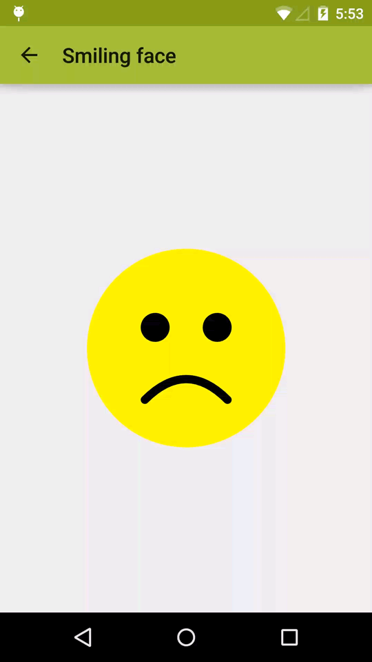

# 利用xml创建vectorAnimation（二）

> 原创：余俊卿 转载请:<yujunqing@meizu.com>

----

> 如果说上一篇里的效果在4.4上也能实现，确实是这么回事，但是这一篇里的效果在4.4上实现起来就比较麻烦了



这个的实现更为简单 同样是一个view 在click的时候做动画

````
imageView = (ImageView) findViewById(R.id.image);
    imageView.setOnClickListener(new View.OnClickListener() {
      @Override
      public void onClick(View v) {
          Drawable drawable = imageView.getDrawable();
          if (drawable instanceof Animatable) {
              ((Animatable) drawable).start();
          }
      }
    });
````

````
<ImageView xmlns:android="http://schemas.android.com/apk/res/android"
    android:id="@+id/image"
    android:layout_width="wrap_content"
    android:layout_height="wrap_content"
    android:layout_gravity="center"
    android:src="@drawable/smiling_face" />
````

@drawable/smiling_face

````
<?xml version="1.0" encoding="utf-8"?>
<animated-vector xmlns:android="http://schemas.android.com/apk/res/android"
    android:drawable="@drawable/face">
    <target
        android:name="mouth"
        android:animation="@anim/smile" />
</animated-vector>
````

@drawable/face

````
<vector xmlns:android="http://schemas.android.com/apk/res/android"
    android:width="200dp"
    android:height="200dp"
    android:viewportHeight="100"
    android:viewportWidth="100">
    <path
        android:fillColor="@color/yellow"
        android:pathData="@string/path_circle" />
    <path
        android:fillColor="@android:color/black"
        android:pathData="@string/path_face_left_eye" />
    <path
        android:fillColor="@android:color/black"
        android:pathData="@string/path_face_right_eye" />
    <path
        android:name="mouth"
        android:pathData="@string/path_face_mouth_sad"
        android:strokeColor="@android:color/black"
        android:strokeLineCap="round"
        android:strokeWidth="@integer/stroke_width" />
</vector>
````

@anim/smile

````
<objectAnimator xmlns:android="http://schemas.android.com/apk/res/android"
    android:duration="3000"
    android:interpolator="@android:anim/accelerate_interpolator"
    android:propertyName="pathData"
    android:valueFrom="@string/path_face_mouth_sad"
    android:valueTo="@string/path_face_mouth_happy"
    android:valueType="pathType" />
````

----

#### 以上是需要的所有素材

看过上一篇分析之后，这一篇就很好理解了。

1. 在animated-vector 标签下定义了初始图片@drawable/face 和 绑定动画 ` <target android:name="mouth" android:animation="@anim/smile" /> `
2. 动画是5.0特殊的动画，android:valueFrom 和 android:valueTo 定义了矢量变化。
   * 两个形状必须是变形兼容：他们必须是具有相同数目的命令和相同数量的命令参数。
   
### 结论

这样看来，我们之后很多动画都可以和设计师完全兼容了！！！

他们再也不能吐槽我们动画做得不对了，是不是很开心！

### 源码

<https://github.com/chiuki/animated-vector-drawable>